# LLMNR Poisoning Complete Breakdown

> *"The most dangerous weapon is the one you never see coming."*

## ⚡ The Mission

I set out on a mission to understand and stop a network attack called LLMNR Poisoning, which can trick computers into giving up their passwords. I wanted to test it out, capture some data, and then secure the network so it wouldn’t happen again. Here’s how it all went down, along with what I learned about defending against both LLMNR and NBT-NS attacks.

---

## Understanding the Attack Vector

Before diving into the technical demonstration, it's essential to understand how LLMNR poisoning works conceptually. The following diagrams illustrate the attack flow and why it's so effective.

### The LLMNR Poisoning Attack Mechanics


In this attack scenario:

**Left side:** When a Windows computer can't find a resource through DNS, it broadcasts an LLMNR request to the entire network asking, "Does anyone know do I connect to \\fff?" This query is visible to everyone on the network—including attackers. Notice how the victim is communicating with both the legitimate server and the attacker simultaneously.

**Right side:** The attacker, who has been silently monitoring network traffic, quickly responds with "Yes, I know. Send me your hash and I'll connect you." The unsuspecting victim then sends authentication credentials to the attacker, who captures the NTLMv2 hash for offline cracking.

### The DNS Failure Trigger

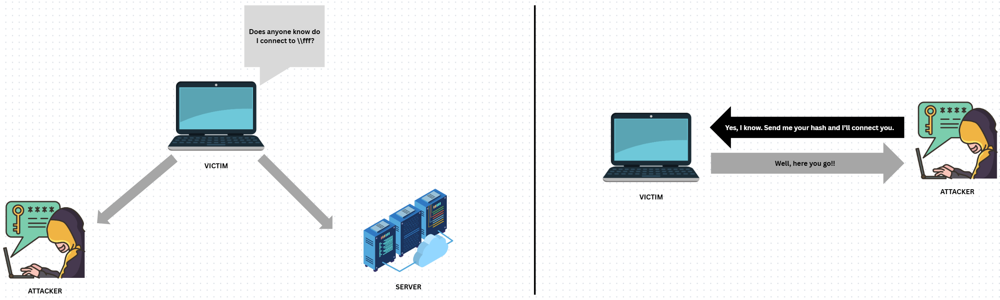

This diagram shows the sequence that creates the vulnerability:

1. The victim computer tries to connect to a network resource (\\fff) that doesn't exist or is mistyped
2. The DNS server responds with "I have no idea what you're talking about"
3. Instead of simply failing, Windows falls back to using the LLMNR protocol, broadcasting its request to the entire local network

This fallback mechanism, while designed for convenience in small networks, creates a significant security gap that attackers can exploit with minimal effort.

**Why This Vulnerability Persists:**
- It's enabled by default in Windows environments
- It requires no special privileges to exploit
- Users have no visual indication they're being attacked
- The entire attack can be performed passively
- It works even on fully patched systems

Now that we understand the concept, let's see how this attack works in practice.

---

## The Hunt Begins

**Objective:** Set up a controlled environment to observe LLMNR poisoning in action.

```
Working Directory: /home/kali/Desktop/active_directory/hacks/LLMNR_Poisoning
```

The lab began in Kali Linux, with all tools primed and ready. My workspace became the command center for the entire operation, storing all findings and evidence gathered during this security exercise.

---

## Laying the Trap

**Weapon of Choice:** Responder - The LLMNR, NBT-NS, and MDNS poisoner

```bash
sudo responder -I eth0 -dPv
```

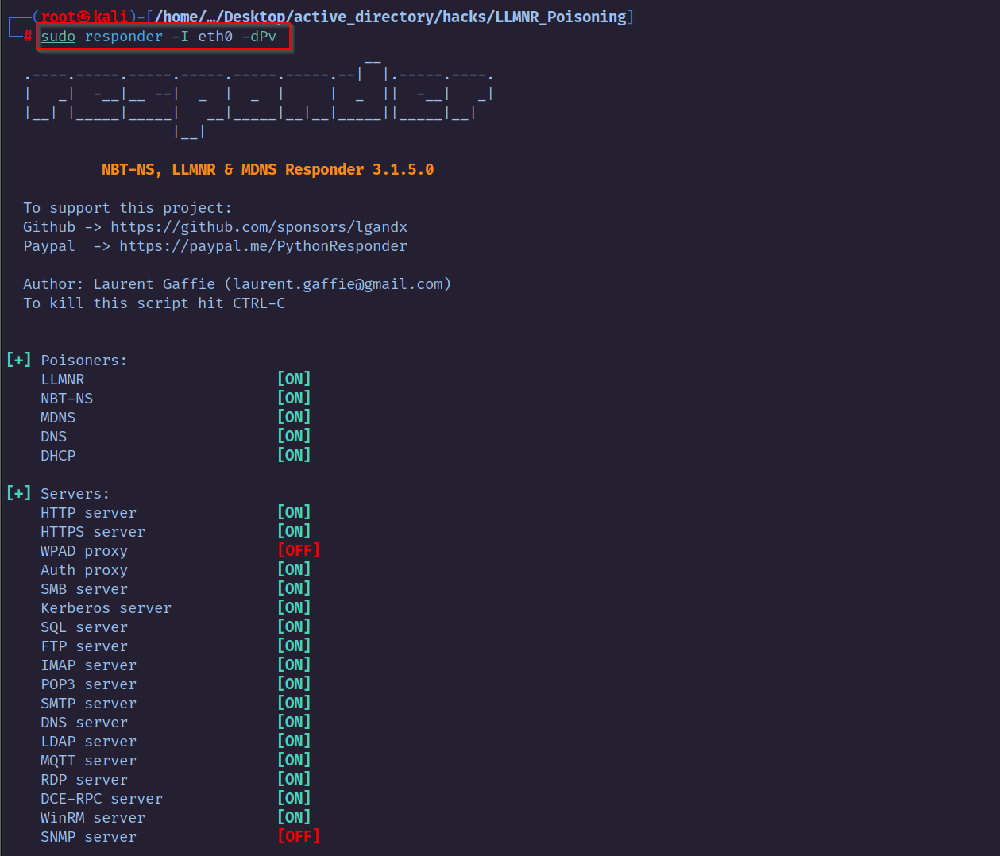
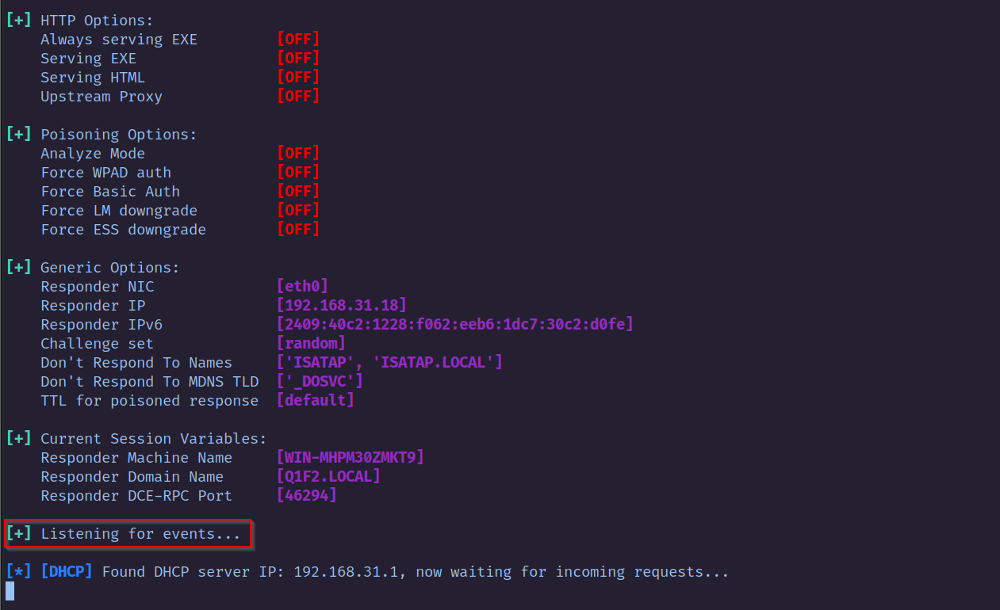

With Responder deployed on the network interface at `192.168.31.18`, I established a silent listener ready to intercept any LLMNR requests. Like an angler fishing in troubled waters, I waited for an unsuspecting system to take the bait.

---

## Capturing the Prey

When a Windows machine attempted to access a non-existent resource via `\\192.168.31.18`, the trap was sprung. Unable to resolve the name through DNS, the system fell back to LLMNR, broadcasting its request across the network.

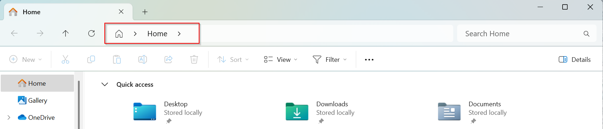
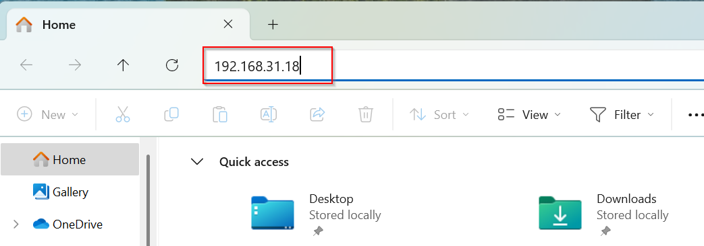

The Windows machine displayed the familiar authentication dialog, prompting for credentials. An unsuspecting user provided their username and password, believing they were connecting to a legitimate resource.

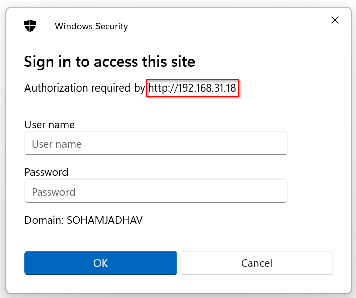
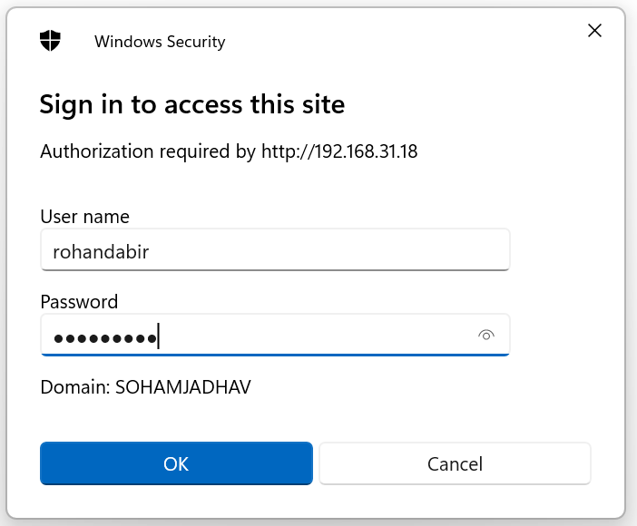

**Success!** The Responder tool intercepted the authentication attempt, capturing the NTLMv2 hash—a digital fingerprint of the user's credentials.

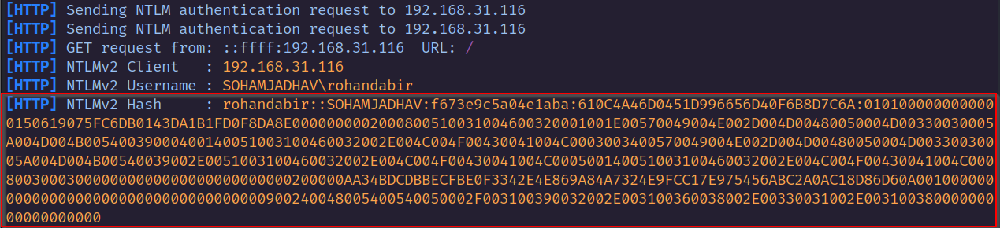

---

## Cracking the Code

With the hash secured in `hash.txt`, the final piece of the puzzle awaited.

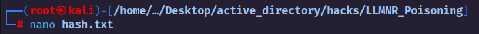
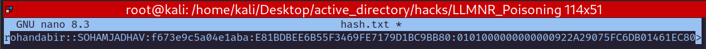

**Enter Hashcat:** The password-cracking powerhouse

```bash
hashcat -m 5600 hash.txt /usr/share/wordlists/rockyou.txt
```

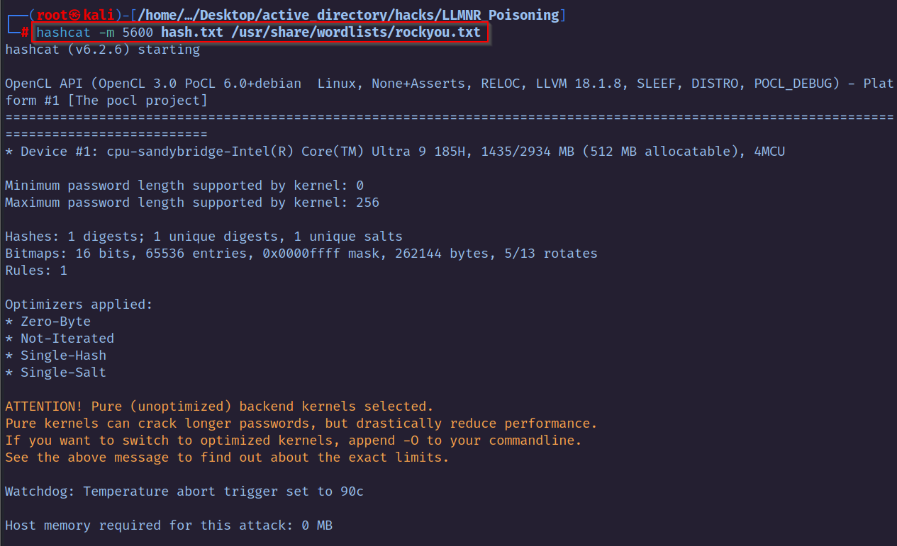

The password `Password1` was quickly revealed—a stark reminder of how easily common passwords fall to modern cracking tools.

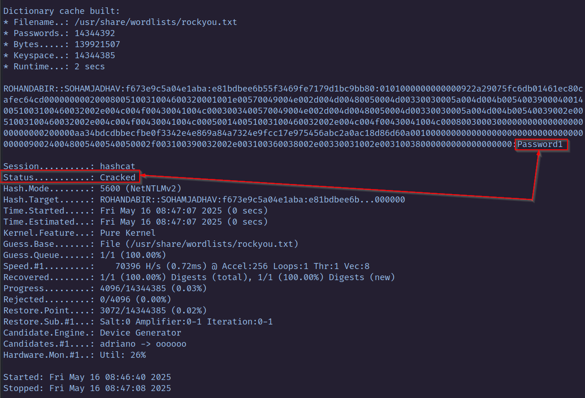

---

## Fortifying the Castle

Having demonstrated the vulnerability, I shifted focus to defense. Using Group Policy, I created a new GPO named `LLMNR-Poisoning-Removal` and linked it to the domain `sohamjadhav.in`.

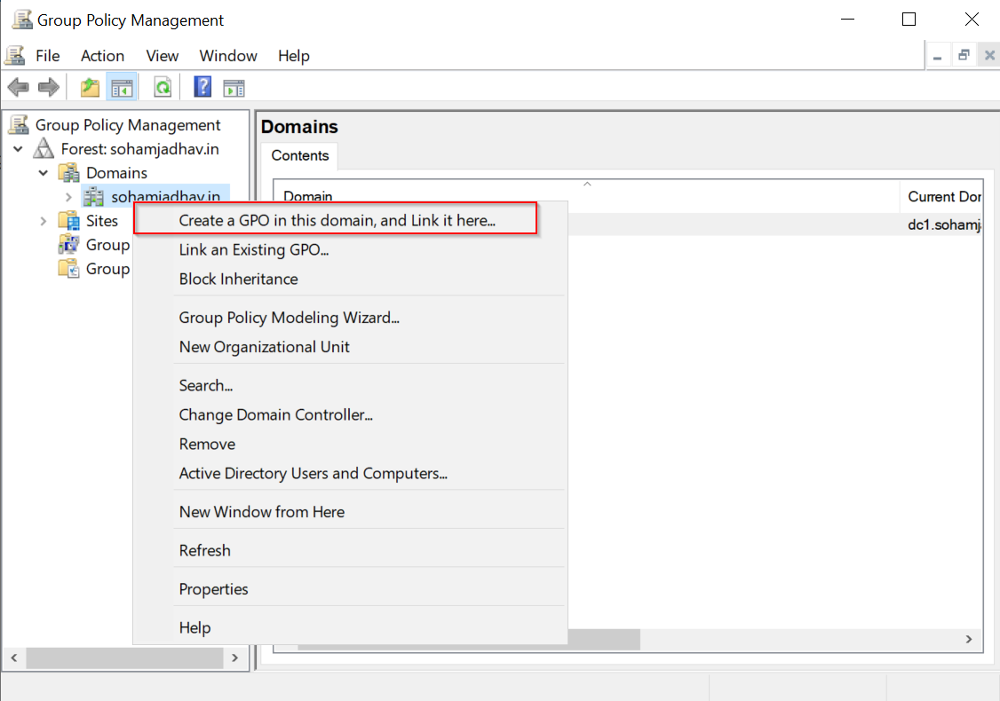
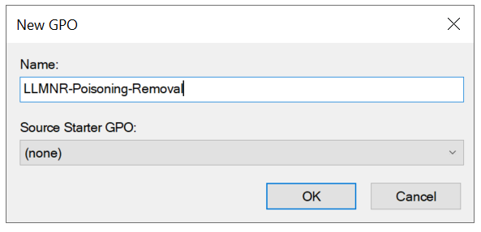

The critical setting: **Computer Configuration > Policies > Administrative Templates > Network > DNS Client > Turn off multicast name resolution**

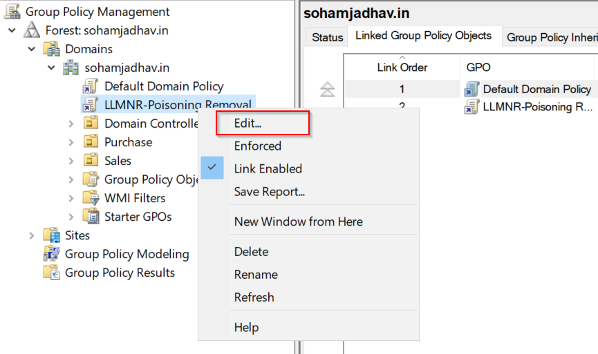
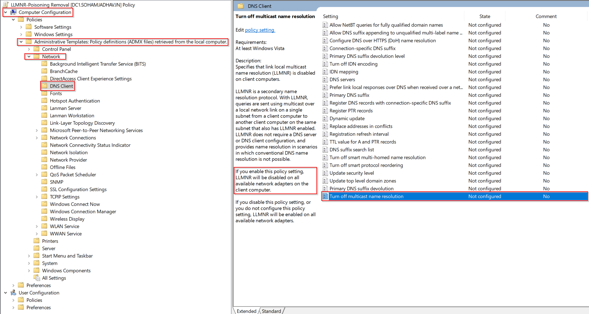

With the policy enforced across the domain, the vulnerability was addressed at scale.

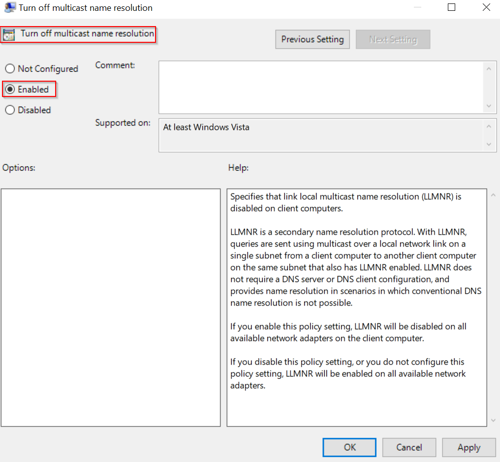


---

## Beyond LLMNR: Comprehensive Defense

To verify our countermeasures, I ran PowerShell on a client machine to check the registry:

```powershell
$(Get-ItemProperty -Path "HKLM:\Software\Policies\Microsoft\Windows NT\DNSClient" -name EnableMulticast).EnableMulticast
```

A return value of `0` confirmed that LLMNR was successfully disabled.

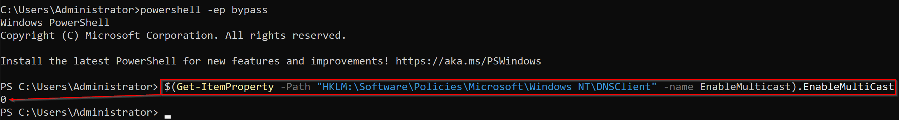

### Additional Security Measures

For complete protection against similar attacks, consider these battle-tested strategies:

1. **Disable NBT-NS**
   - Navigate to Network Connections > Network Adapter Properties > TCP/IPv4 Properties > Advanced tab > WINS tab
   - Select "Disable NetBIOS over TCP/IP"
   - Or deploy via Group Policy/logon script

2. **Network Access Control**
   - Implement 802.1X authentication
   - Deploy MAC address filtering
   - Use VLAN segmentation

3. **Password Policy Enhancement**
   - Enforce passwords longer than 14 characters
   - Implement multi-factor authentication
   - Avoid dictionary words and common patterns

---

## The Aftermath

This lab demonstrates the ease with which credential theft can occur through LLMNR poisoning. By understanding the attack vector and implementing proper countermeasures, network administrators can significantly reduce their attack surface.

> **Disclaimer:** This lab was conducted in a controlled environment for educational purposes only. Always ensure you have proper authorization before performing security testing on any network.

---

## References

- [MITRE ATT&CK: T1557.001](https://attack.mitre.org/techniques/T1557/001/)
- [Microsoft Group Policy Documentation](https://docs.microsoft.com/en-us/windows/client-management/group-policies-overview)
- [Hashcat Documentation](https://hashcat.net/wiki/)
